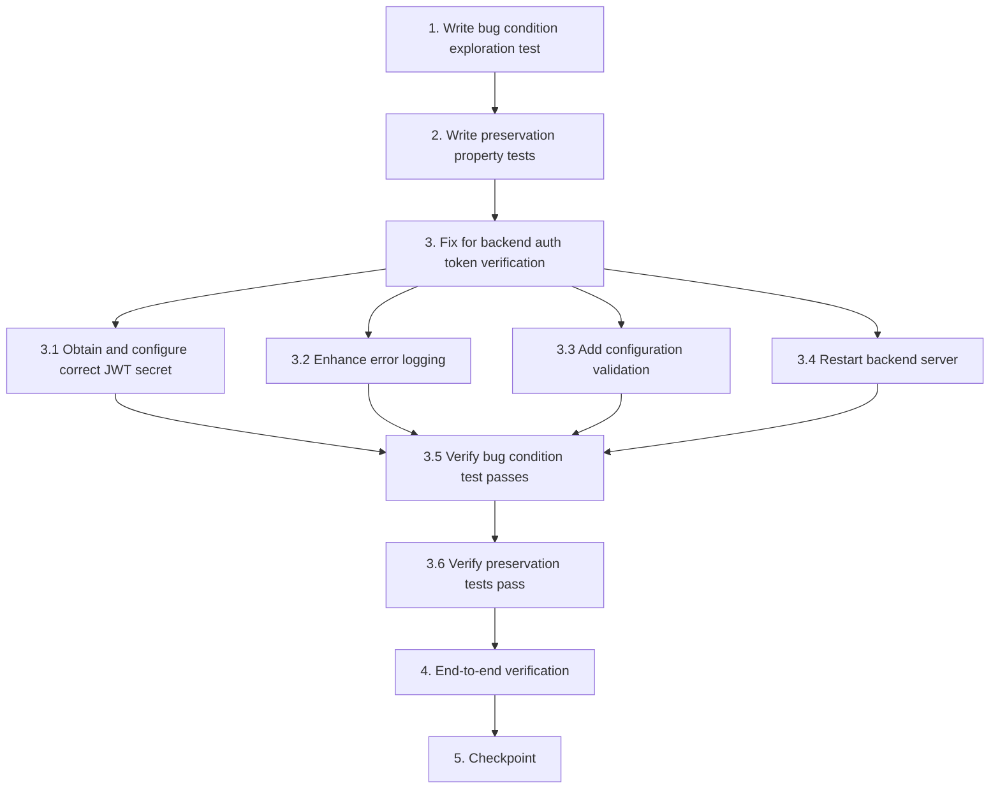

# Implementation Plan

## Overview

This implementation plan follows the exploratory bugfix workflow using the bug condition methodology. Tasks are ordered to:
1. **Explore** - Write tests BEFORE fix to understand the bug (Bug Condition)
2. **Preserve** - Write tests for non-buggy behavior (Preservation Requirements)
3. **Implement** - Apply the fix with understanding (Expected Behavior)
4. **Validate** - Verify fix works and doesn't break anything

---

## Tasks

- [ ] 1. Write bug condition exploration test
  - **Property 1: Bug Condition** - Valid Supabase Token Verification Failure
  - **CRITICAL**: This test MUST FAIL on unfixed code - failure confirms the bug exists
  - **DO NOT attempt to fix the test or the code when it fails**
  - **NOTE**: This test encodes the expected behavior - it will validate the fix when it passes after implementation
  - **GOAL**: Surface counterexamples that demonstrate the bug exists with the current incorrect JWT secret
  - **Scoped PBT Approach**: Scope the property to concrete failing cases - valid Supabase JWT tokens sent to protected endpoints
  - Test implementation details from Bug Condition in design:
    - Generate or obtain a valid Supabase JWT token (authenticate via Supabase client or use test token)
    - Send HTTP request to `GET /api/v1/auth/me` with `Authorization: Bearer <valid_token>`
    - Assert that with the CURRENT (incorrect) JWT secret, the middleware rejects the token
    - Assert that `jwt.verify(token, CURRENT_INCORRECT_SECRET)` throws an error (signature mismatch)
  - The test assertions should match the Expected Behavior Properties from design:
    - After fix: token verification should succeed
    - After fix: user should be attached to `req.user`
    - After fix: endpoint should return user profile data
  - Run test on UNFIXED code (with current incorrect JWT secret in `.env`)
  - **EXPECTED OUTCOME**: Test FAILS with "Invalid or expired token" or JWT signature verification error (this is correct - it proves the bug exists)
  - Document counterexamples found:
    - Record the specific error message from `jwt.verify()` (e.g., "JsonWebTokenError: invalid signature")
    - Record the current value of `SUPABASE_JWT_SECRET` (without exposing full secret)
    - Confirm that the token itself is valid (decode at jwt.io to verify structure and claims)
  - Mark task complete when test is written, run, and failure is documented
  - _Requirements: 1.1, 1.2, 1.3_

- [ ] 2. Write preservation property tests (BEFORE implementing fix)
  - **Property 2: Preservation** - Invalid Token Rejection Behavior
  - **IMPORTANT**: Follow observation-first methodology
  - Observe behavior on UNFIXED code for non-buggy inputs (invalid/missing tokens):
    - Send request without Authorization header → observe 401 "Not authorized to access this route"
    - Send request with malformed Authorization header (e.g., missing "Bearer" prefix) → observe rejection
    - Send request with expired Supabase token (if available) → observe 401 "Invalid or expired token"
    - Send request with tampered token (modified signature) → observe rejection
  - Write property-based tests capturing observed behavior patterns from Preservation Requirements:
    - **Property**: For all requests where `isBugCondition(request) = false` (no token, invalid token, expired token), the middleware SHALL return 401 Unauthorized
    - **Property**: For all requests without Authorization header, the middleware SHALL return "Not authorized to access this route"
    - **Property**: For all requests with malformed tokens, the middleware SHALL reject with appropriate error
    - **Property**: For all requests with expired tokens, the middleware SHALL return "Invalid or expired token"
  - Property-based testing generates many test cases for stronger guarantees:
    - Generate random missing/malformed Authorization headers
    - Generate random invalid token formats
    - Test across multiple protected endpoints (auth/me, events, posts, dashboard)
  - Run tests on UNFIXED code
  - **EXPECTED OUTCOME**: Tests PASS (this confirms baseline security behavior to preserve)
  - Mark task complete when tests are written, run, and passing on unfixed code
  - _Requirements: 3.1, 3.2, 3.3, 3.5, 3.7_

- [ ] 3. Fix for backend auth token verification

  - [ ] 3.1 Obtain and configure the correct Supabase JWT secret
    - Navigate to Supabase Dashboard: https://supabase.com/dashboard/project/xehtvbeoqvuorcpphuvv/settings/api
    - Locate "JWT Settings" section
    - Copy the "JWT Secret" value (base64-encoded string, NOT the anon key or service role key)
    - Update `BACKEND/.env` file: replace current `SUPABASE_JWT_SECRET` value with the correct JWT secret
    - Ensure no extra whitespace or quotes around the value
    - Verify the value is the complete base64 string (typically 64+ characters)
    - _Bug_Condition: isBugCondition(input) where input.headers.authorization contains valid Supabase JWT AND config.supabase.jwtSecret != ACTUAL_SUPABASE_JWT_SECRET_
    - _Expected_Behavior: jwt.verify(token, CORRECT_JWT_SECRET) succeeds for valid tokens, user is attached to req.user, protected endpoints return data_
    - _Preservation: Invalid/missing/expired tokens continue to be rejected with same error messages_
    - _Requirements: 2.1, 2.2, 2.3, 2.4_

  - [ ] 3.2 Enhance error logging in auth middleware
    - Open `src/middlewares/auth.middleware.js`
    - In the `protect` middleware function, add detailed error logging in the JWT verification catch block:
      ```javascript
      catch (error) {
        // Log detailed error for debugging (without exposing sensitive token data)
        console.error('[Auth Middleware] Token verification failed:', {
          errorName: error.name,
          errorMessage: error.message,
          timestamp: new Date().toISOString()
        });
        
        return next(new UnauthorizedException('Invalid or expired token.'));
      }
      ```
    - Add warning log when token is missing:
      ```javascript
      if (!token) {
        console.warn('[Auth Middleware] No token provided in Authorization header');
        return next(new UnauthorizedException('Not authorized to access this route. Please log in.'));
      }
      ```
    - Add success log after successful verification (optional, for development):
      ```javascript
      // After successful jwt.verify()
      console.log('[Auth Middleware] Token verified successfully for user:', decoded.sub);
      ```
    - _Bug_Condition: Enhanced logging helps diagnose JWT verification failures_
    - _Expected_Behavior: Detailed error logs show verification failure reasons (signature mismatch, expiration, etc.)_
    - _Preservation: Error responses to client remain unchanged (401 with same messages)_
    - _Requirements: 2.5_

  - [ ] 3.3 Add configuration validation on server startup
    - Open `src/config/env.config.js`
    - After `dotenv.config()` call, add validation for JWT secret:
      ```javascript
      // Validate required Supabase configuration
      if (!process.env.SUPABASE_JWT_SECRET) {
        throw new Error('SUPABASE_JWT_SECRET is required but not defined in .env file');
      }
      
      if (process.env.SUPABASE_JWT_SECRET.length < 32) {
        console.warn('[Config] SUPABASE_JWT_SECRET seems too short - verify it is the correct JWT secret from Supabase dashboard');
      }
      ```
    - This ensures the server fails fast on startup if JWT secret is missing or suspicious
    - _Bug_Condition: Prevents server from starting with missing/invalid JWT secret_
    - _Expected_Behavior: Server startup fails with clear error message if JWT secret is missing_
    - _Preservation: Server startup continues to load all other environment variables normally_
    - _Requirements: 3.6_

  - [ ] 3.4 Restart backend server with new configuration
    - Stop the current backend server process (Ctrl+C or kill process)
    - Run `npm start` or `npm run dev` from the `BACKEND` directory
    - Verify server starts successfully without configuration errors
    - Check console output for any warnings about JWT secret
    - _Bug_Condition: New JWT secret must be loaded into runtime configuration_
    - _Expected_Behavior: Server starts successfully and loads correct JWT secret_
    - _Preservation: All other server initialization behavior remains unchanged_
    - _Requirements: 3.6_

  - [ ] 3.5 Verify bug condition exploration test now passes
    - **Property 1: Expected Behavior** - Valid Supabase Token Verification Success
    - **IMPORTANT**: Re-run the SAME test from task 1 - do NOT write a new test
    - The test from task 1 encodes the expected behavior
    - When this test passes, it confirms the expected behavior is satisfied
    - Run bug condition exploration test from step 1:
      - Send HTTP request to `GET /api/v1/auth/me` with valid Supabase token
      - Assert that `jwt.verify(token, CORRECT_JWT_SECRET)` succeeds
      - Assert that user is attached to `req.user` with correct user data
      - Assert that endpoint returns user profile data (not 401 error)
    - **EXPECTED OUTCOME**: Test PASSES (confirms bug is fixed)
    - Document the fix validation:
      - Record that token verification now succeeds
      - Record that user profile data is returned successfully
      - Record any success logs from enhanced logging
    - _Requirements: 2.1, 2.2, 2.3, 2.4_

  - [ ] 3.6 Verify preservation tests still pass
    - **Property 2: Preservation** - Invalid Token Rejection Behavior Unchanged
    - **IMPORTANT**: Re-run the SAME tests from task 2 - do NOT write new tests
    - Run preservation property tests from step 2:
      - Test requests without Authorization header → should still return 401
      - Test requests with malformed tokens → should still be rejected
      - Test requests with expired tokens → should still return "Invalid or expired token"
      - Test requests with tampered tokens → should still be rejected
    - **EXPECTED OUTCOME**: Tests PASS (confirms no regressions in security behavior)
    - Confirm all preservation tests still pass after fix:
      - Invalid tokens are still rejected with same error messages
      - Missing Authorization header is still rejected
      - Security behavior is completely unchanged for non-buggy inputs
    - _Requirements: 3.1, 3.2, 3.3, 3.5, 3.7_

- [ ] 4. End-to-end verification across multiple endpoints
  - Test valid token on other protected endpoints beyond `/api/v1/auth/me`:
    - Test `POST /api/v1/events` (event creation)
    - Test `GET /api/v1/posts` (posts listing)
    - Test `GET /api/v1/dashboard` (dashboard data)
  - Verify consistent authentication behavior across all protected routes
  - Verify frontend dashboard successfully loads user data
  - Verify frontend can access all protected features with valid token
  - Document any endpoints that still have issues (should be none)
  - _Requirements: 2.3, 2.4, 3.7_

- [ ] 5. Checkpoint - Ensure all tests pass
  - Run all bug condition exploration tests → should PASS
  - Run all preservation property tests → should PASS
  - Run any existing unit/integration tests → should PASS
  - Verify no regressions in authentication behavior
  - Verify enhanced error logging is working (check console output)
  - Verify configuration validation is working (test with missing JWT secret)
  - Ask the user if questions arise or if any tests are failing

---

## Task Dependency Graph



```json
{
  "waves": [
    {
      "name": "Wave 1: Exploration",
      "tasks": ["1", "2"]
    },
    {
      "name": "Wave 2: Implementation",
      "tasks": ["3.1", "3.2", "3.3", "3.4"]
    },
    {
      "name": "Wave 3: Validation",
      "tasks": ["3.5", "3.6"]
    },
    {
      "name": "Wave 4: Verification",
      "tasks": ["4", "5"]
    }
  ]
}
```

**Dependencies:**
- Task 1 (Bug Condition Test) must be completed before Task 2 (Preservation Tests)
- Task 2 (Preservation Tests) must be completed before Task 3 (Implementation)
- Tasks 3.1-3.4 can be done in parallel or sequence, but all must be completed before 3.5
- Task 3.5 (Verify Bug Fix) depends on all implementation tasks (3.1-3.4)
- Task 3.6 (Verify Preservation) depends on Task 3.5
- Task 4 (E2E Verification) depends on Task 3.6
- Task 5 (Checkpoint) depends on Task 4

---

## Notes

- **Bug Condition**: Valid Supabase JWT tokens fail verification due to incorrect JWT secret in `.env`
- **Expected Behavior**: Valid tokens should be verified successfully using correct JWT secret from Supabase dashboard
- **Preservation**: Invalid/missing/expired tokens should continue to be rejected with same error messages
- **Root Cause**: `SUPABASE_JWT_SECRET` environment variable contains incorrect value (UUID/project ID instead of actual JWT secret)
- **Fix**: Replace JWT secret with correct value from Supabase Dashboard > Project Settings > API > JWT Settings
