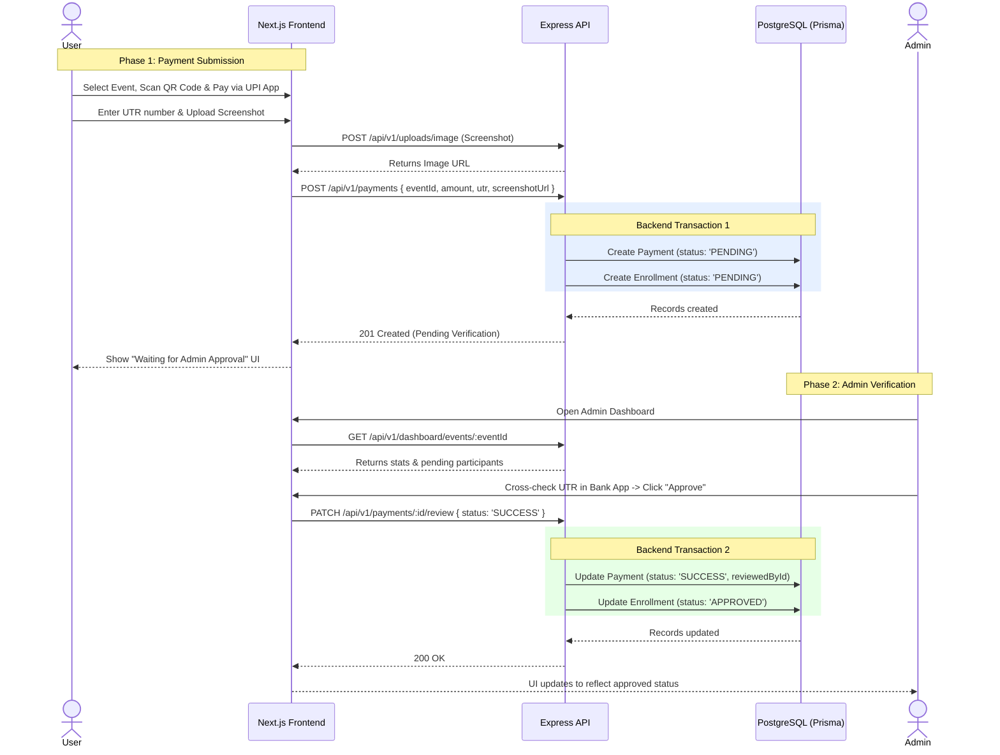

# IndriyaX Manual Payment & Verification Flow

This document outlines the architecture and step-by-step data flow of the manual UPI payment system. Because we are bypassing automated payment gateways (like Razorpay or Stripe), the system relies on a two-step "Pending → Verification" state machine managed securely via database transactions.

---

## 1. Flow Diagram

The following sequence diagram illustrates the interaction between the User, the Next.js Frontend, the Express Backend, the Database, and the Admin.

---

## 2. Step-by-Step Breakdown

### Phase 1: User Submission

1. **QR Code Scan** — The user views the event details on the frontend. The frontend displays the organization's static UPI QR code.
2. **Payment** — The user pays using their preferred UPI app (GPay, PhonePe, etc.) on their phone.
3. **Form Submission** — The user receives a 12-digit UTR (Transaction ID) from their app. They enter this UTR and upload an optional screenshot of the success screen.
4. **API Call** — The frontend sends a `POST /api/v1/payments` request containing the `eventId`, `utr`, `amount`, and `screenshotUrl`.
5. **Database Transaction** — The Express backend intercepts this request. To prevent corrupted data, it opens a Prisma Transaction:
   - It creates a `Payment` record with `status: PENDING`.
   - It creates an `Enrollment` record with `status: PENDING`.
   - If either creation fails, both are rolled back automatically.

### Phase 2: Admin Verification

1. **Dashboard Review** — The Admin logs into the platform, navigates to the dashboard, and views a list of pending verifications for a specific event.
2. **Validation** — The Admin looks at the provided `utr` and `screenshotUrl`, and cross-references it with their actual bank account statement to confirm the money arrived.
3. **Approval / Rejection:**
   - If valid, the Admin clicks **"Approve"**.
   - If invalid/fake, the Admin clicks **"Reject"** and provides a `rejectionReason`.
4. **API Call** — The frontend sends a `PATCH /api/v1/payments/:id/review` request with `{ status: 'SUCCESS' }` (or `REJECTED`).
5. **Database Transaction** — The backend opens a second Prisma transaction:
   - If `SUCCESS`: Updates `Payment` to `SUCCESS` and `Enrollment` to `APPROVED`.
   - If `REJECTED`: Updates `Payment` to `REJECTED` and `Enrollment` to `REJECTED`.
   - The admin's `userId` is recorded in the `reviewedById` field for auditing purposes.

---

## 3. Database State Matrix

Understanding how the two tables map to each other during this flow:

| Lifecycle Stage       | Payment Model Status | Enrollment Model Status | User Access to Event |
|-----------------------|----------------------|-------------------------|----------------------|
| 1. Just Submitted     | `PENDING`            | `PENDING`               | ❌ Denied            |
| 2. Admin Approved     | `SUCCESS`            | `APPROVED`              | ✅ Allowed           |
| 3. Admin Rejected     | `REJECTED`           | `REJECTED`              | ❌ Denied            |