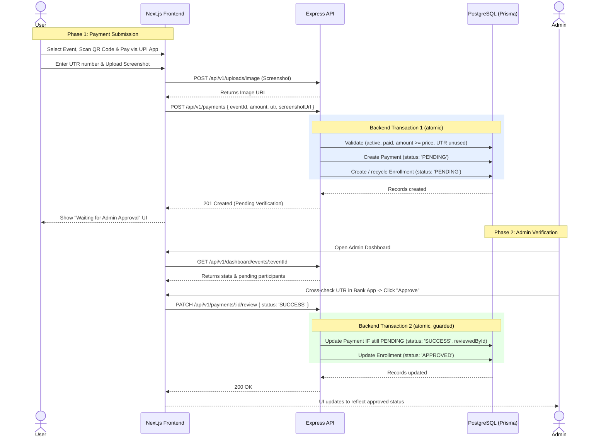

# IndriyaX Manual Payment & Verification Flow

This document outlines the architecture and step-by-step data flow of the manual UPI payment system. Because we bypass automated payment gateways (Razorpay, Stripe, etc.), the system relies on a two-step **"Pending → Verification"** state machine managed securely via database transactions.

---

## 1. Flow Diagram

---

## 2. Step-by-Step Breakdown

### Phase 1: User Submission

1. **QR Code Scan** — The user views the event details (via `GET /api/v1/events/:slug`, which includes the event-specific UPI QR code, UPI ID, and price) and pays in their UPI app.
2. **Payment** — The user pays via GPay / PhonePe / etc.
3. **Form Submission** — The user receives a UTR (transaction reference) and **uploads a screenshot** of the success screen (the screenshot is **required**; its public URL is obtained from the uploads endpoint first).
4. **API Call** — The frontend sends `POST /api/v1/payments` with `eventId`, `amount`, `utr`, and `screenshotUrl`.
5. **Backend Business Validation** — Before creating anything, the API verifies:
   - The event exists and is **active** (else `404`).
   - The event is **paid** (`isFree: false`; else `400`).
   - `amount` is **≥** the event's `price` (no underpaying; else `400`). Overpayment is allowed.
   - The `utr` (normalized to uppercase) is **not already used** by any payment (else `409`).
6. **Database Transaction (atomic)** — If validation passes, a single Prisma transaction:
   - Inspects any existing enrollment for this user+event.
   - Creates a `Payment` (`PENDING`) and creates **or recycles** an `Enrollment` (`PENDING`) — see Retry below.
   - Rolls everything back automatically if any step fails.

### Phase 2: Admin Verification

1. **Dashboard Review** — The admin views pending verifications for an event.
2. **Validation** — The admin inspects the `utr` and `screenshotUrl` and cross-references their bank statement.
3. **Approve / Reject:**
   - Valid → **Approve**.
   - Invalid/fake → **Reject** with a `rejectionReason` (required, 5–500 chars).
4. **API Call** — `PATCH /api/v1/payments/:id/review` with `{ status: 'SUCCESS' }` or `{ status: 'REJECTED', rejectionReason }`.
5. **Database Transaction (atomic, guarded)** — A second Prisma transaction:
   - Updates the payment **only if it is still `PENDING`** (a no-longer-pending payment cannot be re-processed → `409`).
   - `SUCCESS` → Payment `SUCCESS`, Enrollment `APPROVED`. `REJECTED` → both `REJECTED`.
   - Records the admin's id in `reviewedById` and stamps `reviewedAt`.

---

## 3. Retry After Rejection

A user gets **at most one enrollment per event** (`@@unique(userId, eventId)`), but a rejection is not a dead end:

| Existing enrollment state | New submission result                                                        |
|---------------------------|------------------------------------------------------------------------------|
| `REJECTED`                | Allowed — enrollment recycled to `PENDING`, a **new** payment is created      |
| `PENDING`                 | Blocked (`409`) — a payment is already awaiting review                        |
| `APPROVED`                | Blocked (`409`) — the user is already enrolled                               |

- The resubmission must use a **new, unused UTR** (reusing any UTR → `409`).
- The previous `REJECTED` payment row is **kept** for audit history; only the enrollment is reused.
- The submission response includes `"retried": true` for resubmissions.

---

## 4. Database State Matrix

| Lifecycle Stage             | Payment Status | Enrollment Status | User Access to Event |
|-----------------------------|----------------|-------------------|----------------------|
| 1. Just Submitted           | `PENDING`      | `PENDING`         | ❌ Denied            |
| 2. Admin Approved           | `SUCCESS`      | `APPROVED`        | ✅ Allowed           |
| 3. Admin Rejected           | `REJECTED`     | `REJECTED`        | ❌ Denied            |
| 4. Resubmitted after reject | `PENDING` (new)| `PENDING`         | ❌ Denied            |

> The old `REJECTED` payment from stage 3 persists alongside the new `PENDING` payment in stage 4. Revenue and counts are computed from `SUCCESS` / `APPROVED` records only, so historical rejected attempts never inflate totals.

---

## 5. Safety & Integrity Guarantees

| Concern                       | Guarantee                                                                                   |
|-------------------------------|---------------------------------------------------------------------------------------------|
| Partial writes                | Payment + Enrollment are created/updated in a single atomic transaction                      |
| Double submission (races)     | Enforced by the `@@unique(userId, eventId)` constraint inside the transaction                |
| UTR reuse / fraud             | Enforced by the `@unique` constraint on `Payment.utr` (case-normalized)                      |
| Double approval (two admins)  | Guarded conditional update — only a still-`PENDING` payment transitions; the loser gets `409` |
| Abuse / scripted submissions  | Payment submission is rate-limited to **10 / minute / user**                                 |
| Underpayment                  | Rejected (`amount < price` → `400`)                                                          |